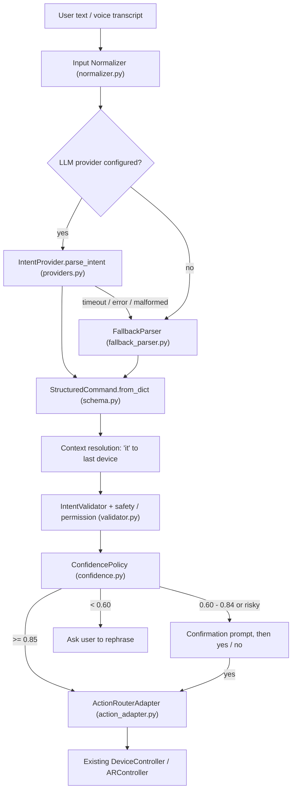

# Phase 10: Natural-Language Intent Engine

The intent engine turns typed text or voice transcripts into **validated structured commands**. Those commands go through the action layer that already exists from Phases 5, 6 and 8 (`DeviceController` → `CommandBus` → Arduino, and `ARController`).

> The AI never executes anything itself. LLM providers and the rule parser can only *propose* a command. Before anything runs, that proposal is schema-parsed, validated, checked against the permission scope and checked for confidence.

## Architecture



| Module | Responsibility |
|---|---|
| `intent/schema.py` | **Single source of truth**: intents, actions, required entities, devices, blocked actions, `StructuredCommand` |
| `intent/normalizer.py` | Lowercases text, strips punctuation, removes fillers ("could you please") and articles, converts number words |
| `intent/entities.py` | Pluggable entity extractors (`EntityExtractor.register`) |
| `intent/fallback_parser.py` | Deterministic rule-based parser, including multi-action splitting |
| `intent/providers.py` | `IntentProvider` interface, `OpenAIIntentProvider`, provider registry |
| `intent/validator.py` | Schema checks plus safety and permission checks |
| `intent/confidence.py` | Threshold policy (the only place thresholds are interpreted) |
| `intent/messages.py` | Confirmation, clarification and error text for the user |
| `intent/action_adapter.py` | Maps each command onto existing controller operations (decides **how**) |
| `intent/engine.py` | Runs the pipeline and holds the confirmation state and conversation context |
| `intent/service.py`, `intent/api.py` | Service boundary and an optional local HTTP API |

## Supported intents

| Intent | Actions | Required entities |
|---|---|---|
| `device_control` | `turn_on`, `turn_off`, `toggle`, `set_level`, `increase_level`, `decrease_level` | `device` (+ `value` for `set_level`) |
| `display_control` | `increase_brightness`, `decrease_brightness`, `set_brightness` | `value` for `set_brightness` |
| `media_control` | `play`, `pause`, `stop`, `next_track`, `previous_track`, `volume_up`, `volume_down`, `set_volume` | `value` for `set_volume` |
| `navigation` | `next`, `previous`, `select` | none |
| `gesture_command` | `enter_control`, `select`, `confirm` | none |
| `face_command` | `show_effect`, `hide_effect`, `next_effect`, `previous_effect` | none |
| `system_command` | `emergency_stop`, `status` | none |
| `multi_action` | up to 5 child commands, each validated on its own | none |
| `unknown` | none (never executed) | none |

**Entities:** `device`, `location`, `target`, `value`, `amount`, `direction`, `duration`, `application`, `media`, `person`, `gesture`.

**Devices:** `light`, `fan`, `music`, `servo`, `all`. These map to the `DeviceType` values in the registry.

**Blocked (permission scope):** `shutdown_host`, `restart_host`, `delete_files`, `run_shell`, `install_software`, `open_application`, `send_message`, `make_payment`. The parsers recognise these so the user gets a clear refusal, but they can never be routed to execution.

## Command schema

```json
{
  "intent": "device_control",
  "action": "turn_on",
  "entities": { "device": "fan", "location": "bedroom" },
  "parameters": {},
  "confidence": 0.95,
  "requires_confirmation": false,
  "raw_input": "turn on the bedroom fan"
}
```

A multi-action command looks like this:

```json
{
  "intent": "multi_action",
  "actions": [
    { "intent": "device_control", "action": "turn_on", "entities": { "device": "fan" } },
    { "intent": "display_control", "action": "decrease_brightness", "entities": {} }
  ],
  "confidence": 0.95
}
```

The validator rejects a command when it finds any of the following:

- malformed JSON or wrong field types
- an unsupported intent, action, entity or device
- a missing required entity (the user is asked to clarify)
- a non-numeric numeric field
- an out-of-range value (bounds come from the live registry; for example, the fan only goes from 0 to 3)
- a nested `multi_action`
- a blocked action

## Confidence thresholds

These are set in `config.py` / `.env`:

| Setting | Default | Meaning |
|---|---|---|
| `INTENT_AUTO_EXECUTE_THRESHOLD` | `0.85` | At or above this, the command runs automatically |
| `INTENT_CONFIRM_THRESHOLD` | `0.60` | From this up to the auto-execute threshold, the user must confirm. Below it, the user is asked to rephrase |

Confidence scores assigned by the fallback parser:

| Score | Input type | Example |
|---|---|---|
| 0.95 | Explicit command | "turn on the fan" |
| 0.90 | Shorthand | "fan on" |
| 0.72 | Colloquial | "kill the fan" |
| 0.50 | Unresolved pronoun | "turn it on" |

If a pronoun is resolved from context, the score is capped at 0.80, so the user is asked to confirm.

## Confirmation flow

A command needs confirmation when its confidence falls in the confirm band, **or** when it is a bulk action on `all` devices (turn on, turn off, toggle or set level):

```
User:   Turn off everything.
System: I understood that you want to turn off all connected devices. Should I continue?
User:   yes        → executed      (no / cancel → cancelled)
```

- Pending commands expire after `INTENT_CONFIRMATION_TIMEOUT` seconds (default 30).
- A pending command is validated again just before it runs.
- Typing any other command drops the pending one.
- In the app window, press `y` to confirm and `n` to cancel.

## Fallback parser

`FallbackParser` is pure, deterministic and works offline. It handles:

- power on/off phrasing ("turn on", "switch on", "start", "fan on", "lights off")
- brightness, volume and media phrasing
- navigation, AR effects, emergency stop and status
- the `and` / `then` / `,` connectors in multi-action commands, with the verb carried over ("turn on the fan and the light")

It is used when:

- no provider is configured
- the provider times out (the engine enforces `INTENT_PROVIDER_TIMEOUT` even if a provider hangs)
- the provider raises an error
- the provider returns output that fails schema parsing

## LLM provider abstraction

```python
class IntentProvider(ABC):
    name: str
    available: bool
    def parse_intent(self, text, context=None) -> dict: ...
```

- `INTENT_PROVIDER=auto` (the default) uses OpenAI when `OPENAI_API_KEY` is set, and otherwise uses only the deterministic parser.
- To add Gemini or a local model, subclass `IntentProvider` and call `register_provider("gemini", factory)`. The engine itself does not change.
- The OpenAI system prompt is generated from `schema_summary()`, so the prompt and the validator cannot drift apart.

## API usage

**Python service (the canonical boundary):**

```python
from intent import IntentEngine, IntentService
engine = IntentEngine.from_config(cfg, device_controller=ctrl, ar_controller=ar)
svc = IntentService(engine)
svc.parse({"input": "turn on the bedroom fan"})    # parse only, never executes
svc.execute({"input": "turn off everything"})      # full pipeline; may return NEEDS_CONFIRMATION
svc.confirm(); svc.cancel()
```

**Optional HTTP API:** enable it with `INTENT_API_ENABLED=true`. It binds to `127.0.0.1:8765` and uses only the standard library.

| Method and path | Purpose |
|---|---|
| `POST /api/intent/parse` | Parse only. Body: `{"input": "..."}` |
| `POST /api/intent/execute` | Run the full pipeline |
| `POST /api/intent/confirm` | Run the pending command |
| `POST /api/intent/cancel` | Drop the pending command |
| `GET /api/intent/schema` | Return the schema summary |

Example request:

```bash
curl -s -X POST localhost:8765/api/intent/parse -d '{"input":"turn on the bedroom fan"}'
```

Response:

```json
{"success": true, "status": "READY", "message": "Ready to turn on the bedroom fan.",
 "intent": {"intent": "device_control", "action": "turn_on",
            "entities": {"device": "fan", "location": "bedroom"},
            "parameters": {}, "confidence": 0.95, "requires_confirmation": false},
 "source": "fallback", "validation_code": "OK", "errors": [], "execution": null}
```

**Statuses:**

| Status | Meaning |
|---|---|
| `READY` | Parsed and validated, not run (parse-only calls) |
| `EXECUTED` | Ran successfully |
| `NEEDS_CONFIRMATION` | Waiting for yes/no |
| `NEEDS_CLARIFICATION` | Missing information, unclear reference or low confidence |
| `REJECTED` | Failed validation or outside the permission scope |
| `CANCELLED` | User cancelled, or the confirmation expired |
| `EXECUTION_FAILED` | The action layer could not complete the command |
| `ERROR` | Unexpected internal error (no internal details are shown to the user) |

## UI

- The HUD has an **INTENT ENGINE** panel showing:
  - the user's command
  - the interpreted command
  - the confidence score
  - the current state
  - the confirmation prompt or result message
- You can type commands in the terminal that launched the app.
- Press `i` to cycle through demo commands.
- Commands run on a background worker thread, so the camera loop is never blocked.

## Logging

Logs go to the `visioncontrol.intent` logger as JSON lines, one per stage:

| Stage | What it records |
|---|---|
| `input` | Raw input (truncated, long digit runs masked) and normalised text |
| `parsed` | Intent, actions, entities, confidence, source |
| `provider_fallback` | Why the LLM output was not used |
| `validation` | Validation result and error code |
| `confidence` | Score and the decision taken |
| `confirmation` | Confirmed or cancelled |
| `execution` | Success, message, devices touched |
| `result` | Final status |
| `error` | Unexpected errors |

Set `INTENT_LOG_RAW_INPUT=false` to hide user text from the logs entirely.

## Testing strategy

`tests/test_intent_engine.py` contains 83 tests. They cover:

- the schema and malformed-input handling
- the normalizer
- basic commands and natural variations
- entity extraction
- ambiguous commands ("turn it on", "make it brighter", "do that")
- context resolution
- multi-action parsing and execution
- invalid and empty input
- blocked commands
- validator rejection of unsafe LLM-shaped output
- confidence bands
- the confirmation flow (confirm, cancel, expiry, abandon)
- provider timeout, hang, error and malformed responses, each falling back to the deterministic parser
- execution through the real virtual `DeviceController`
- the service and HTTP API
- thread safety
- HUD rendering

Run the suite with:

```bash
venv/bin/pytest -q
```
